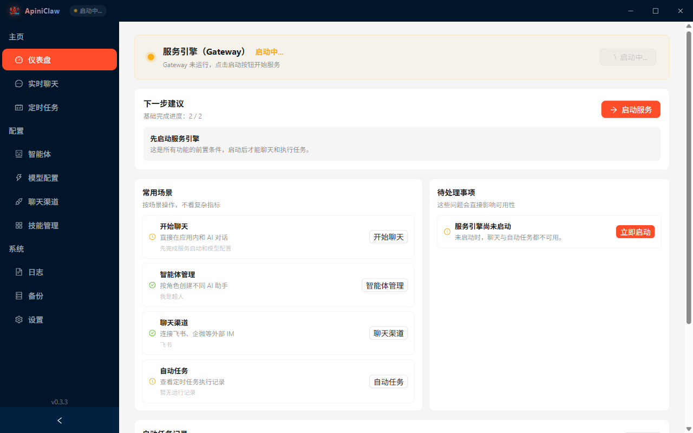
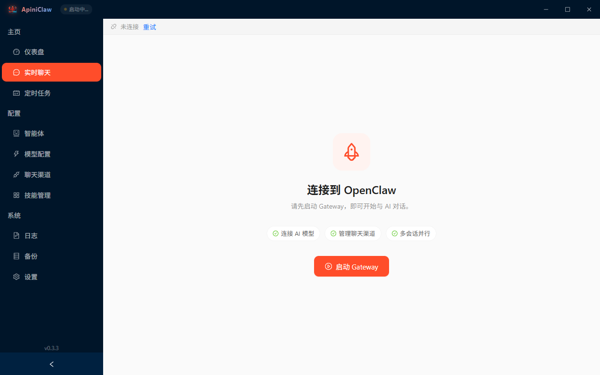
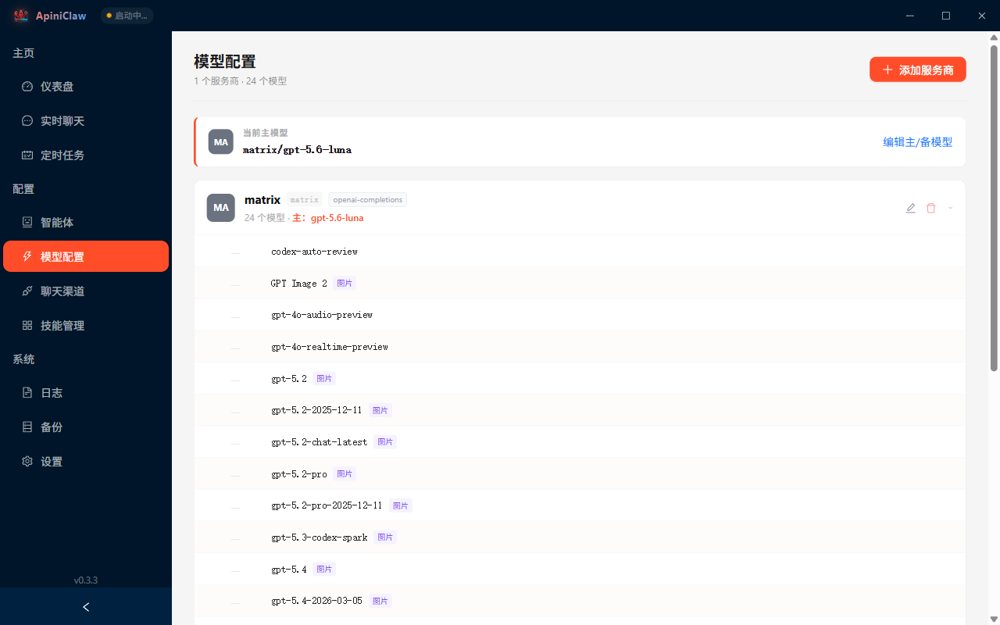
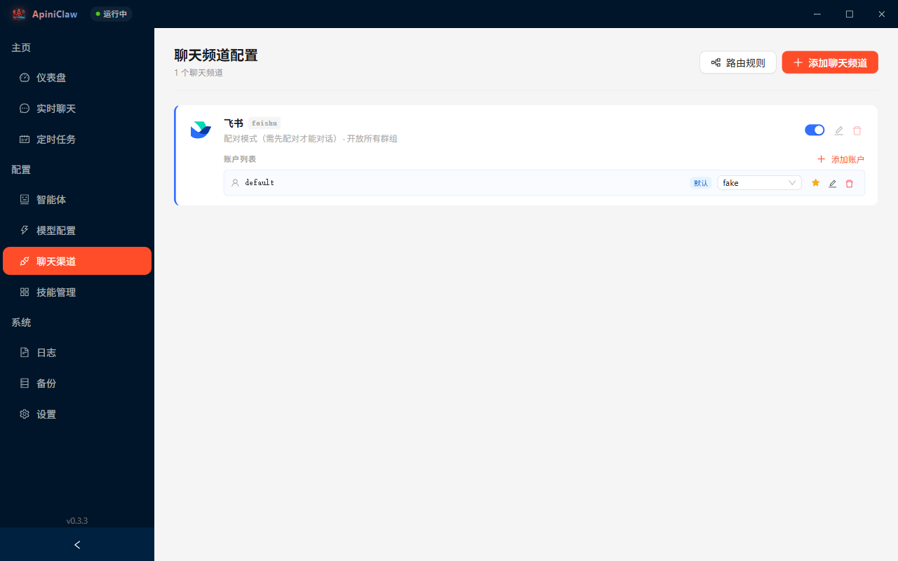
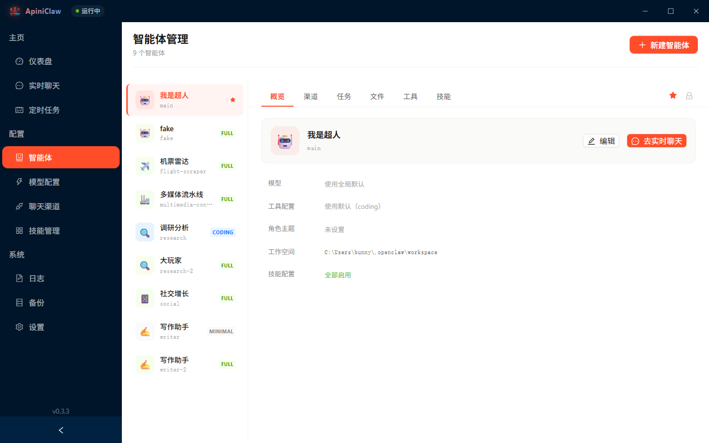
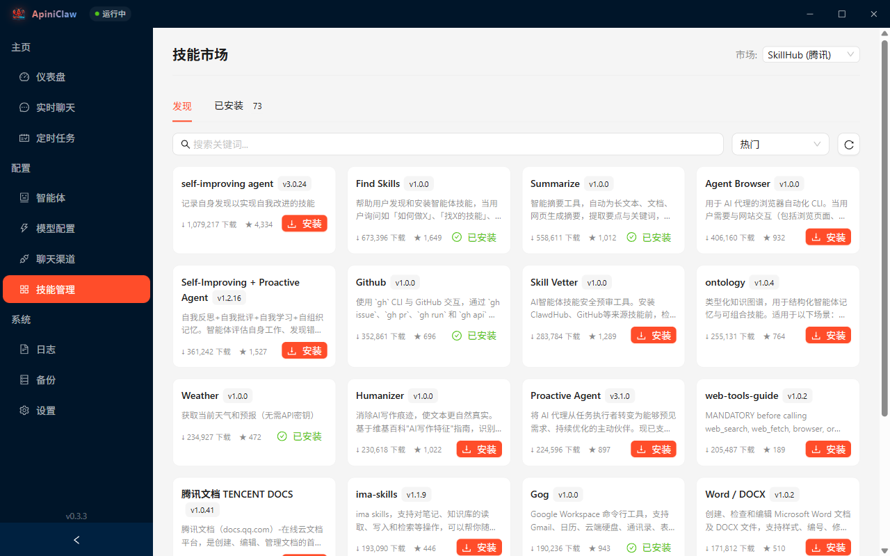
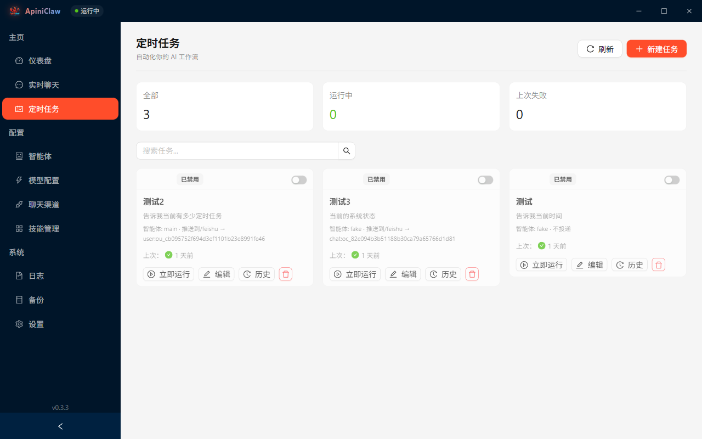
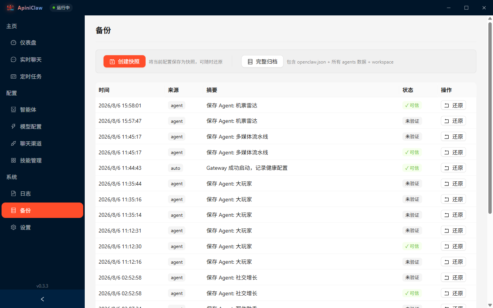

<p align="center">
  
</p>

<h1 align="center">ClickClaw</h1>

<p align="center">
  <strong>One-click OpenClaw deployment for everyone</strong><br/>
  <sub>No environment setup, no terminal commands — scan a QR code to create Feishu/WeCom bots</sub>
</p>

<p align="center">
  
  
  
  
  
  
</p>

<p align="center">
  <a href="README.md">简体中文</a> | English
</p>

<p align="center">
  <strong>This repository (community fork)</strong>:
  <a href="https://github.com/ntz857/clickclaw">github.com/ntz857/clickclaw</a><br/>
  Upstream:
  <a href="https://github.com/clickclaw/clickclaw">clickclaw/clickclaw</a>
  · Site (reference):
  <a href="https://www.clickclaw.cn">clickclaw.cn</a>
</p>

---

## About this fork

This is a **community-maintained fork** of [ClickClaw](https://github.com/clickclaw/clickclaw).

While upstream desktop releases have slowed, this fork keeps working against **newer OpenClaw Gateway versions (e.g. 2026.7+)** and improves chat / channel UX. License remains **AGPL-3.0** (see root `LICENSE`).

**Notable changes vs upstream include:**

- Gateway runtime resolution and protocol handshake aligned with system OpenClaw
- Chat: local `MEDIA:` paths and image preview/save; Mermaid / LaTeX
- Channel message display: Feishu-style envelope stripping, reply quotes, `media:document` file cards
- MessagePresentation card preview (limited desktop interactions)
- Cron / payload fixes and verification helpers

> For official binaries and product site, prefer [upstream](https://github.com/clickclaw/clickclaw). This fork focuses on source maintenance and self-built packages.

---

## What is ClickClaw

[OpenClaw](https://github.com/OpenClaw) is a powerful AI agent framework, but its installation and configuration can be challenging — requiring Node.js, command-line operations, and manual JSON editing.

**ClickClaw** exists to eliminate that barrier. It wraps the entire deployment process into a visual desktop app, bundling Node.js 22 + OpenClaw runtime, so anyone can have their own AI assistant up and running in minutes.

**Core features:**

- **Zero-dependency install** — Bundled runtime, download and run, no Node.js or CLI tools needed
- **Fully visual** — Model setup, channel connection, pairing approval, Agent management — all through a GUI
- **QR code bot creation** — For Feishu and WeCom, just scan a QR code to auto-create apps and fill in credentials
- **Auto crash recovery** — Gateway auto-retries on failure, then guides one-click restore from healthy snapshots
- **AI security vetting** — Automatically analyzes code risk level and permission scope before skill installation
- **In-app pairing approval** — IM users send pairing requests, desktop app pops up real-time approval with one-click accept or deny
- **Multi-Agent multi-channel** — Different channels and accounts can bind to different AI personas, each with its own role
- **HTTP proxy support** — Built-in proxy settings for accessing international services like OpenAI and Telegram

---

## Screenshots

<table>
  <tr>
    <td align="center"><strong>Dashboard</strong></td>
    <td align="center"><strong>Live Chat</strong></td>
  </tr>
  <tr>
    <td></td>
    <td></td>
  </tr>
  <tr>
    <td align="center"><strong>Model Config</strong></td>
    <td align="center"><strong>Channels</strong></td>
  </tr>
  <tr>
    <td></td>
    <td></td>
  </tr>
  <tr>
    <td align="center"><strong>Agent Management</strong></td>
    <td align="center"><strong>Skills Marketplace</strong></td>
  </tr>
  <tr>
    <td></td>
    <td></td>
  </tr>
  <tr>
    <td align="center"><strong>Cron Tasks</strong></td>
    <td align="center"><strong>Backup</strong></td>
  </tr>
  <tr>
    <td></td>
    <td></td>
  </tr>
</table>

---

## Features

<table>
  <tr>
    <td width="50%">

**🚀 5-Step Setup Wizard**

Environment detection → Model config → Channel config → Confirm → Launch. Fully guided, no terminal needed.

</td>
    <td width="50%">

**💬 Live Chat**

WebSocket direct to Gateway, multi-session management, streaming Markdown rendering, `/` slash commands.

</td>
  </tr>
  <tr>
    <td>

**🤖 Agent Management**

Create multiple AI personas, edit workspace files (AGENTS.md / SOUL.md / MEMORY.md), fine-grained tool permissions and Skills allowlist.

</td>
    <td>

**📡 IM Channels**

Feishu, WeCom, QQ Bot, DingTalk, Telegram, Discord, Slack. QR quick-create for Feishu/WeCom, multi-account, pairing approval.

</td>
  </tr>
  <tr>
    <td>

**🔧 Model Config**

Domestic (Moonshot / Qwen / Zhipu / DeepSeek …), international (Claude / GPT / Gemini), custom endpoints. One-click API Key verification, batch import from remote model lists.

</td>
    <td>

**🧩 Skills Marketplace**

Browse ClawHub marketplace, AI security vetting before install. Installed skills support enable/disable, inline API Key editing, export.

</td>
  </tr>
  <tr>
    <td>

**⏰ Cron Tasks**

Interval / cron expression / one-shot scheduling, assign Agent for auto-execution, run history tracking.

</td>
    <td>

**⚙️ Settings & Operations**

Language switch, proxy config, auto-update (desktop + engine), live logs, smart snapshot backup & crash recovery.

</td>
  </tr>
</table>

---

## Getting Started

### Download

Grab the installer for your platform from [Releases](https://github.com/clickclaw/clickclaw/releases):

| Platform | Architectures |
|----------|--------------|
| macOS | Apple Silicon (arm64) / Intel (x64) |
| Windows | x64 / arm64 |

### Uninstall & Data Directories

- On Windows uninstall, a checkbox is shown: `Delete ClickClaw local data (~/.clickclaw)` (unchecked by default)
- If unchecked, only the app is removed and `~/.clickclaw` is kept
- `~/.openclaw` (OpenClaw config and credentials) is always preserved and is never deleted by ClickClaw uninstall

### First Launch

The Setup Wizard guides you through all configuration:

1. **Environment Detection** — Auto-scan for existing OpenClaw and port usage
2. **Configure Model** — Choose a Provider (domestic / international / custom), enter and verify API Key
3. **Configure Channels** — Select IM channels, Feishu/WeCom support QR quick-create (skippable)
4. **Confirm** — Review configuration summary
5. **Launch** — Write config, start Gateway, enter main UI

---

## Build from Source

### Prerequisites

- Node.js 18+
- npm 9+

### Development

```bash
git clone https://github.com/ntz857/clickclaw.git
cd clickclaw
npm install
npm run dev
```

### Commands

| Command | Description |
|---------|-------------|
| `npm run dev` | Hot-reload dev mode |
| `npm run lint` | ESLint + TypeScript type checking |
| `npm run typecheck` | Type checking only |
| `npm test` | Vitest single run |
| `npm run build:win` | Windows package |
| `npm run build:mac` | macOS package |

### Tech Stack

| Layer | Technology |
|-------|-----------|
| Desktop Framework | Electron 40+ |
| Build Tool | electron-vite 5 |
| UI | React 19 + Ant Design 6 |
| State Management | Zustand |
| i18n | i18next |
| Packaging | electron-builder |
| Testing | Vitest |

---

## Contributing

Bug fixes, features, docs, and translations are welcome.

1. Fork https://github.com/ntz857/clickclaw
2. Create a feature branch (`git checkout -b feature/xxx`)
3. Commit your changes
4. Open a Pull Request against **this** repository

> Style: ESLint + Prettier; UI strings via i18n; tests when practical.

Optional: track upstream

```bash
git remote add upstream https://github.com/clickclaw/clickclaw.git
git fetch upstream
```

---

## Acknowledgements

- [Original ClickClaw](https://github.com/clickclaw/clickclaw) — desktop app foundation
- [OpenClaw](https://github.com/OpenClaw) — AI agent runtime
- [Electron](https://www.electronjs.org/) — cross-platform desktop framework
- [React](https://react.dev/) — UI library
- [Ant Design](https://ant.design/) / [Ant Design X](https://x.ant.design/) — UI and chat components

---

## License

Released under [AGPL-3.0](LICENSE) (see root `LICENSE`).  
Derived from [clickclaw/clickclaw](https://github.com/clickclaw/clickclaw). If you distribute binaries or offer the software as a network service, comply with AGPL obligations (including providing corresponding source).

---

<p align="center">
  <sub>ClickClaw community fork — OpenClaw desktop manager</sub><br/>
  <sub><a href="https://github.com/ntz857/clickclaw">ntz857/clickclaw</a></sub>
</p>
